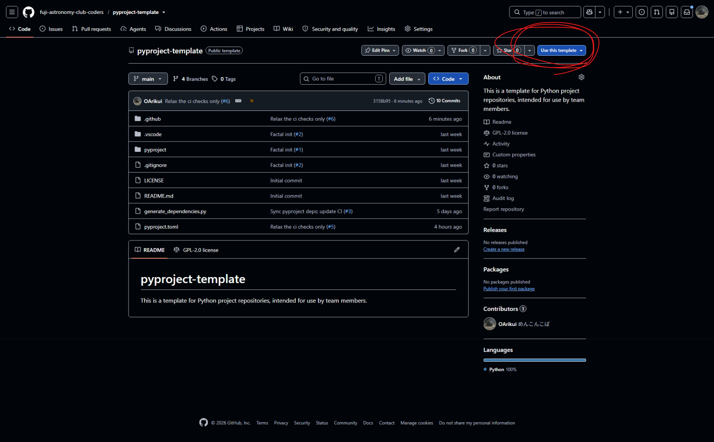

# Steps for using this template

## 1. Create new repository

pyproject-templateのgithubページから、`Use this template`>`Create new repository`を選択。

## 2. New repository setting

### 2-1. Repository name を入力

プロジェクトの成果物となるソフト/ツールは何ができるツールなのかを意識して設定しましょう。

文字化けを防ぐためにascii文字のみで作成します。

> [!IMPORTANT]
> 内容が一目でわかり、似ているプロジェクトと区別が簡単につくような名前を設定してください。
> そのために、プロジェクトの目的と特徴を理解することが重要です。
> また、40文字を超えない程度の長すぎない名前を心がけてください

### 2-2. Description

より詳細な説明を記入します。

背景・目的・具体的なメソッド・あらすじ等のプロジェクト概要を記入してください。

### 2-3. Choose visibility

リポジトリの公開/非公開を選択できます。

プライベートリポジトリの機能制限/オープンソースの思想に則り、基本は公開にしましょう。

個人情報や流出してはいけない内容が含まれないかどうかを確認し、必要に応じて非公開に設定してください。

## 3. Ruleset

編集のルールを設定するためのルールセットを作製

`上部タブ`>`setting`から、`Rulesets`>`Rulesets`ページを開き、`New Ruleset`>`Import a ruleset`をクリックします。

