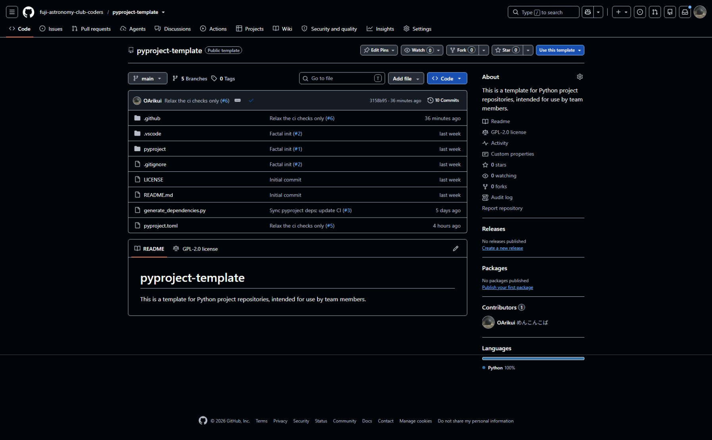
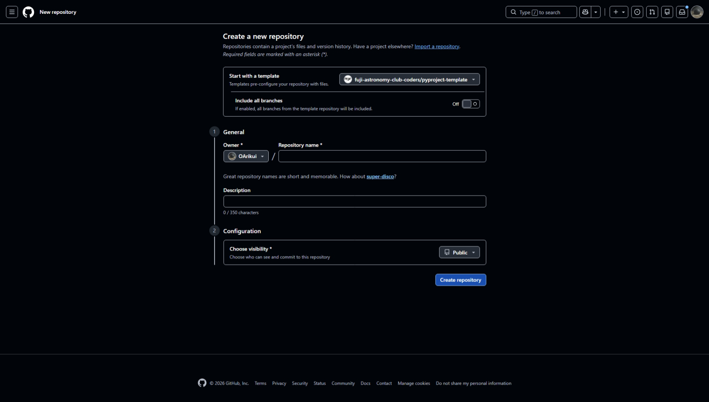
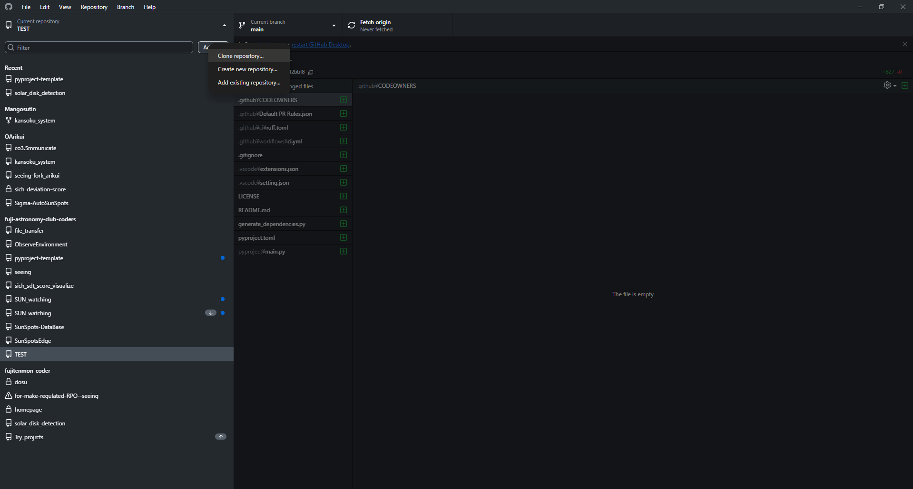
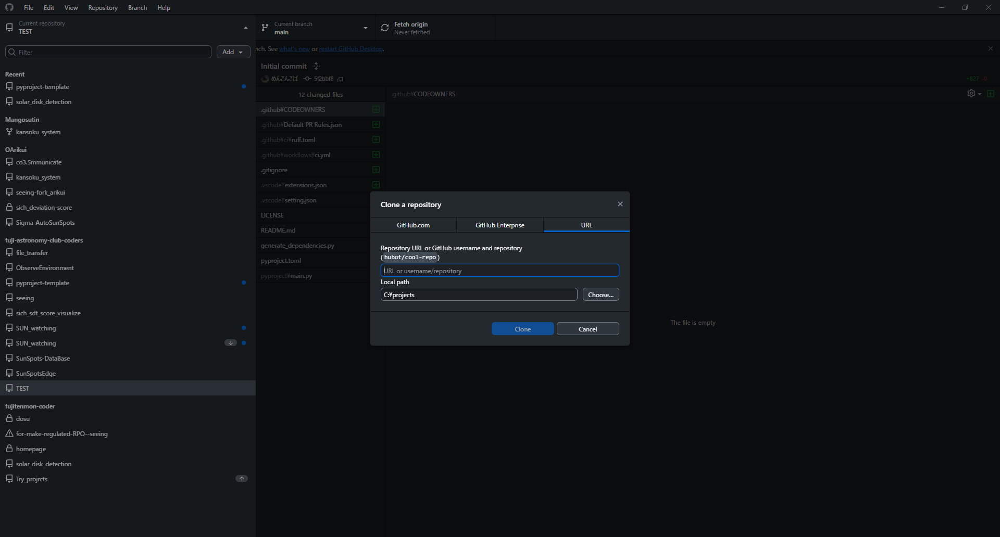
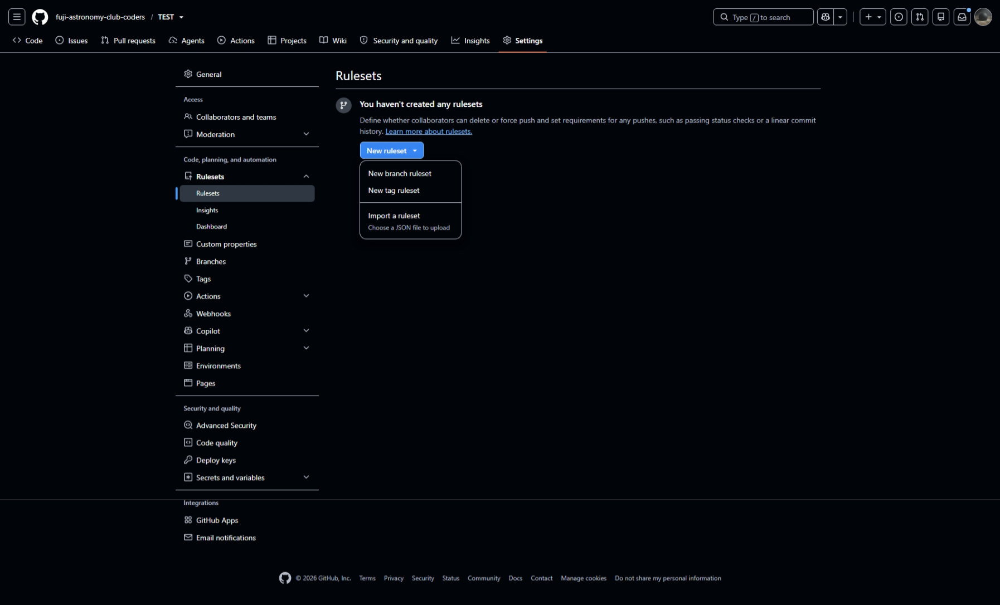
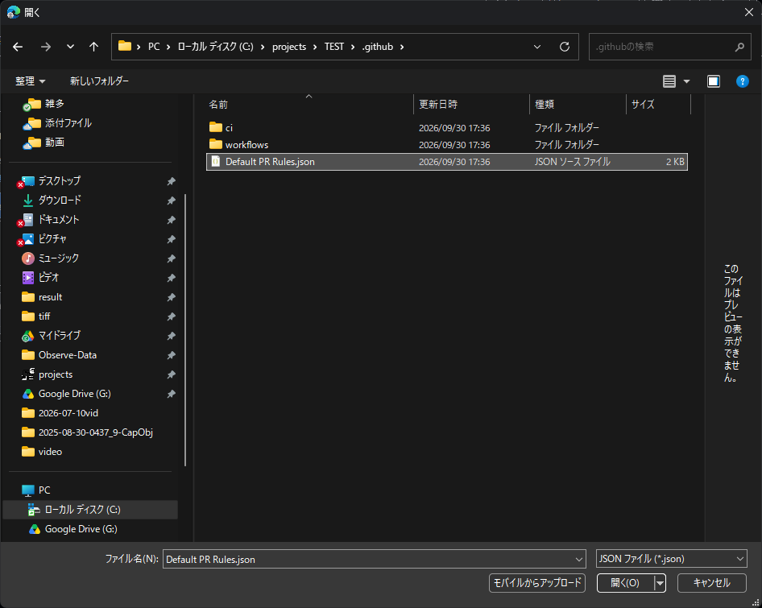
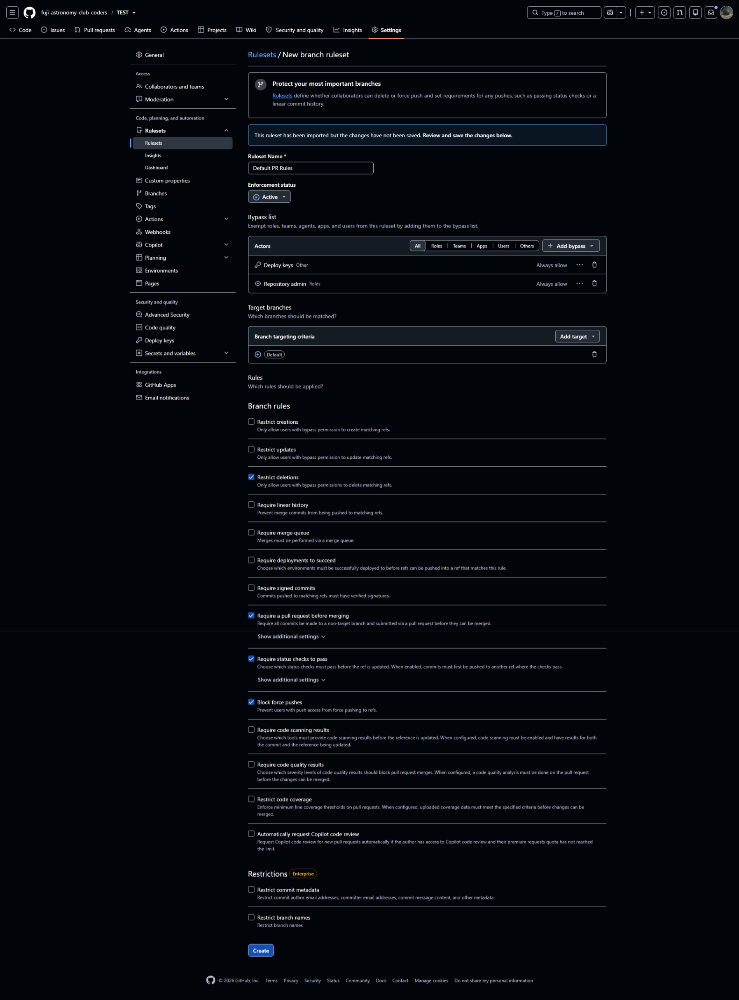

# Steps for using this template

本説明では、便宜上新しいリポジトリ名を"TEST"としています

## 1. Create new repository

pyproject-templateのgithubページから、`Use this template`>`Create new repository`を選択。

## 2. New repository setting

### 2-1. Repository name を入力

プロジェクトの成果物となるソフト/ツールは何ができるツールなのかを意識して設定しましょう。

文字化けを防ぐためにascii文字のみで作成します。

> [!IMPORTANT]
> 内容が一目でわかり、似ているプロジェクトと区別が簡単につくような名前を設定してください。
> そのために、プロジェクトの目的と特徴を理解することが重要です。
> また、40文字を超えない程度の長すぎない名前を心がけてください

### 2-2. Description

より詳細な説明を記入します。

背景・目的・具体的なメソッド・あらすじ等のプロジェクト概要を記入してください。

### 2-3. Choose visibility

リポジトリの公開/非公開を選択できます。

プライベートリポジトリの機能制限/オープンソースの思想に則り、基本は公開にしましょう。

個人情報や流出してはいけない内容が含まれないかどうかを確認し、必要に応じて非公開に設定してください。

> [!NOTE]
> 
> プロジェクトの限られた機密ファイル(APIkeyなど)が存在する場合は、`.gitignore`に追加することでpushを避ける手段もあります。

## 3. Build setting

### 3-1. Clone repository

プロジェクトを立ち上げるにあたっての設定をするために、複数ファイルの編集等の操作が必要なため、クローンしてローカルで作業できるようにする。

1. github desktopサイドメニューから、`add`>`clone repository`をクリック

2. githubのリポジトリのリンクとクローン先のディレクトリを選択してクローンする。

### 3-2. Edit ReadME

- [ ] templateを作成する。

### 3-3. Package directory setting

package nameを考え、"pyproject"directoryをpackage nameにrenameしてpackage directoryを作成してください。

package nameは小文字英数,ハイフンのみで作成しましょう。

このdirectoryは例えば、ほかのプロジェクトに丸々コピーして使ったりする、プログラムの本体です。repository nameと同じでもいいですが、相対pathを使うときに区別がつかないのでより簡潔な1~3語程度のpackage nameを使いましょう。

例:`weather-calibrated-global-monitor`(気象補正機能付き自動全球観測装置)

| リポジトリ名                              | パッケージ名                                                                                 |
| ----------------------------------- | -------------------------------------------------------------------------------------- |
| *weather-calibrated-global-monitor* | *wc_global_monitor*    or *weather_cal_gm* or *atmoglobe* (Atmosphere + Globe) |

> 
> 
> [!NOTE]
> 
> **相対pathを使う時に区別がつかないとは?**
> 
> もしpackage nameがリポジトリnameと同じだった場合、
> 
> package directoryのpathは`C://python/projects/TEST/TEST`になります。
> 
> - `C://python/projects/TEST/note.txt`
> 
> - `C://python/projects/TEST/TEST/note.txt`
> 
> というファイルの相対pathがいずれも
> 
> `TEST/note.txt`
> 
> になる場合があります。これでは区別がつきません。

package directoryが作成できたら、次は`pyproject.toml`の編集です。

### 3-4. Pyproject setting

root directoryに`pyproject.toml`というファイルがあります。これはbasedpyrightやruffといったLSPの設定ファイルであると同時に、プロジェクトの環境要件やステータスを示す取扱説明書のようなものになります。

#### 3-4-1. Project explain

`[project]`セクションの`name`(L6)と`description`(L8)を編集します。

1. `name`は、プロジェクト名なのでリポジトリ名と同じで大丈夫です。

2. `description`は、プロジェクトの簡素な説明です。リポジトリのDescriptionと同じでもよいですし、新たに100~120字程度の説明を書いてもよいです。

#### 3-4-2.  Tools package setting

LSPにpackageの場所を教えるために`pyproject.toml`の各LSP項目にpackage nameを渡します。

これから示す場所に、プレースホルダーとして`pyproject`というpackage nameをしていているので、設定したpackage nameに置換してください。

1. `[tool.setuptools]`>`packages`(L23)

2. `[tool.basedpyright]`>`include`(L66)

## 4. Ruleset

編集のルールを設定するためのルールセットを作成

このテンプレートのルールセットは適用するとmain branchに直接pushができなくなるので、先にチュートリアルのファイルを削除しましょう。

### 4-1. 不要ファイルの削除

- `TEST/tutorial/manual.md`

- `TEST/tutorial/assets/*.png`
  
  

不要ファイルを削除したら、リポジトリのファイルはもう準備万端なので、commit message=`init`でコミットしましょう。

この時、パッケージ名やリポジトリ名にアクロニム等の略称を使っている場合など、記録すべきことがあればdescription(コミットメッセージで2行改行後のテキスト)に記載しましょう。

### 4-2. ルールセットの設定

`上部タブ`>`setting`から、`Rulesets`>`Rulesets`ページを開き、`New Ruleset`>`Import a ruleset`をクリックします。

エクスプローラビューが開いたら、`TEST\.gitgub\Default PR Rules.json`を選択し、決定します。

jsonファイルに保存されていた設定が読み込まれ、各項目に値が入力されるので、一番下の`Create`ボタンでルールセットを作成してしまいましょう。

